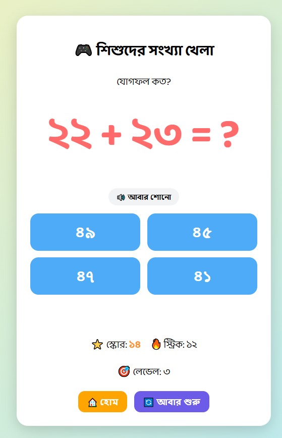

# 🎮 Kids Number Game

Kids Number Game is a simple educational game I built for children to practice numbers and basic math in a fun way.

The game currently supports both **English and Bangla**. I also added Bangla voice instructions so children can listen to the question instead of only reading it.

## 📸 Screenshot

### Home Screen


### Game Screen

## What can you do in the game?

There are currently three game modes:

- 🔢 Number Recognition
- ➕ Addition
- ➖ Subtraction

The game starts with smaller numbers and gets harder as new levels are unlocked.

It also has:

- English and Bangla language support
- Bangla voice questions
- English voice using browser speech
- Repeat voice button
- Score and streak system
- Level 1, 2 and 3
- Level unlocking
- Correct and wrong answer feedback
- Different encouraging Bangla voice messages
- Confetti animation for correct answers
- Home and restart options
- Saved unlocked levels using Local Storage

## 🔊 Bangla Voice

One thing I wanted in this project was proper Bangla audio for kids.

For this, I used **Python and Edge TTS** to generate the Bangla MP3 files. The game then plays the required audio depending on the question.

For example, an addition question like:

```text
3 + 5 = ?
```

can also be heard in Bangla.

The same system is used for number recognition, subtraction and feedback messages.

## 🛠️ Built With

- HTML
- CSS
- JavaScript
- Python
- Edge TTS
- Web Speech API
- Local Storage

## ▶️ Run the Game

Clone the project:

```bash
git clone https://github.com/newmaheen/kids-number-game.git
```

Go into the folder:

```bash
cd kids-number-game
```

Start a local server:

```bash
python -m http.server 8000
```

Then open this address in your browser:

```text
http://localhost:8000
```

## 🚧 Still Working On It

This project is still being improved. I plan to add more features and make the interface better for children, especially on mobile devices.

Some ideas for later:

- Progress bar
- Stars and rewards
- Lives system
- More math activities
- Better mobile layout
- Player progress tracking

## 👨‍💻 Author

**Maheen Absar**

This is one of my learning projects where I am practicing JavaScript while building something useful and interactive.
